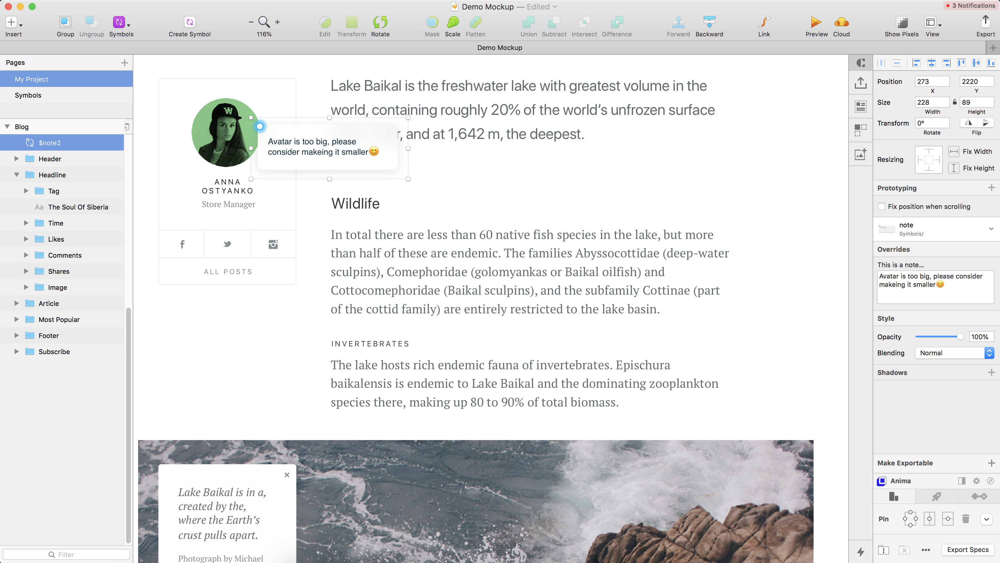

# Sketchy Notes

Add notes to your Sketch designs to help you in your collaborative work in the same environment.

## Add Notes
Add comments, remarks, feedbacks, love letters you name it!

## Manage Notes
Manage your notes in one place in one list.

## Navigate Notes
Jump to notes across your sketch artboard.

## How Does It Work?
It’s simple. Just add the “$” at the beginning of any text and $ketchy Notes will do the rest.

